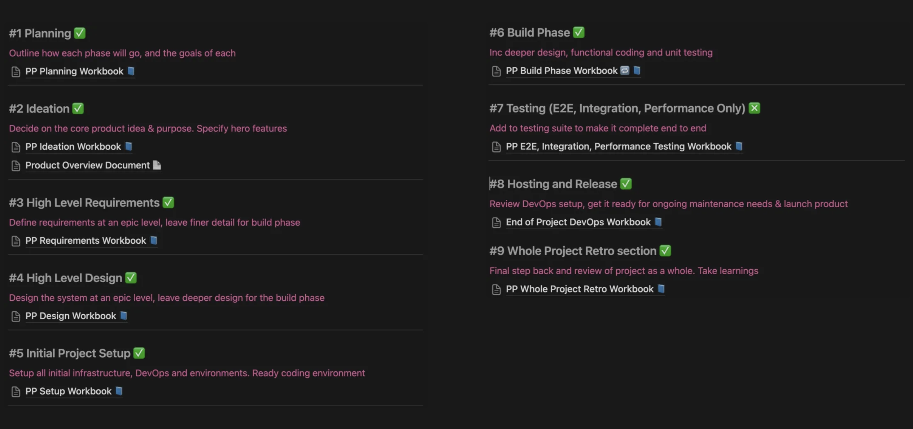
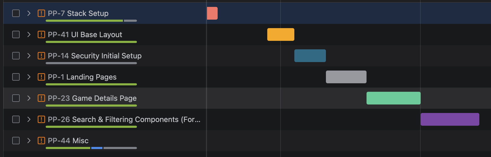
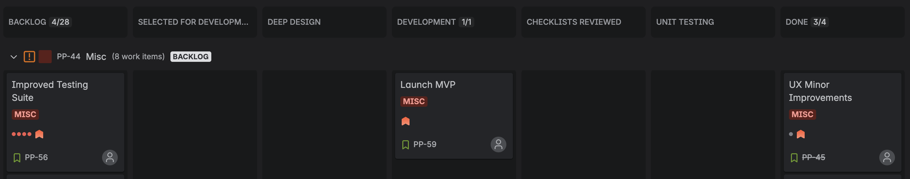

# Playstack
Check it out - Playstack is live and can be found here: [**play-stack.com**](https://play-stack.com)

# 🎯 My Personal Goal

The driving force behind this project was learning. I wanted to build something meaningful—an app that not only solves a real problem I care about, but also pushed me to grow as a developer.

My goal was to design and build a full-stack web application that touches every layer of modern development, with enough depth in each area to give me a solid and well-rounded foundation. I focused on balancing functionality with technical challenges to ensure I got hands-on experience where it counts.

I'm proud to say this project delivered on that goal—and I’m now more confident in my skills and excited to keep building from here.

# 💡 Inspiration & The Problem

First and foremost, Playstack is an application built for gamers who, like me, face a growing problem, one that has me thinking:

*“I have so many gaming platforms, so many wishlists, so many libraries and so many dashboards. Its frankly now a massive chore to look through my games catalogues, reflect on old titles and to enjoy the once fun process of deciding what I want to play next…”*

And so, with the initial release of [play-stack.com](http://play-stack.com), I aim to lay the foundations of an application that will solve this ever growing frustration faced by me and many others alike.

# 💾 Technology Used

| Frontend | Backend | Testing | Deployment & Versioning | Other |
| --- | --- | --- | --- | --- |
| React | Node.js | Jest | Git | Vite |
| Redux | Express.js | React Testing Library | Github Actions | Nodemon |
| React Router | Typescript | Supertest | Render | Jira |
| Typescript |  |  |  | Notion |
| Material UI + Swiper |  |  |  | Excalidraw |
|  |  |  |  | YAML |

# 🎬 Project Highlights

### 🖥️ Frontend

- **Responsive Modern UI** — Optimised for mobile, tablet, and desktop. Achieved by using reactive design principals with a combination of grids and flexbox,  persistent layout/outlet components as well as a modular variable based CSS class system.
- **Advanced Search & Filters** — Genre, platform, and keyword-based filtering using dynamic query construction. Results dynamically rendered and paged with infinite scrolling.
- **Redux State Management** — ****Global app state managed via Redux, with local component state covered by React states. Redux Thunks utilised to fetch external data, centralising logic inside the Slice to avoid convoluted API calls.
- **CSS, from Scratch + Libraries** — ****To aid learning, a number of higher complexity components have been created from scratch (infinite carousel, filters sidebar, game card image gallery), as well as leveraging libraries such as Material UI and Swiper.

### ⚙️ Backend

- **Controller → Service Design** — Abstracted approach to building backend to ensure decoupled service layer to controller and ultimately the frontend.
- **Express.js API & Middleware** — Express used with various libraries to ensure central error reporting, authentication and security through middleware.

### 🧩 General

- **Modular Build Approach** — ****Where appropriate modularity and abstraction have been used, ensuring more efficient extension and maintenance. This includes smart/dumb container approach for UI and controller/service for backend.
- **Security Considerations** — XXS, network & authentication addressed throughout application.
- **Typescript and ESLint** — Used throughout development to help reduce missed code issues and runtime errors.

### 📦 Hosting / DevOps

- **Render Deployment & Hosting** — Render connected to Github to enable continuous build, deployment & hosting of the frontend + backend.
- **Github Actions for CI/CD** — Github Actions used to kick off the CI?CD pipeline. Testing pre-deployments to Render, and monitoring Playstack for errors.

# 📜 Project Approach

From the start, I set out to treat this like a professional-grade project, despite it being a solo effort. I followed a structured, phase-based approach to ensure the project stayed focused, organised, and ultimately successful.

I used Jira for task tracking and Notion for documentation and planning. Below, I’ve highlighted just the key elements of the process—enough to give you insight without falling into "death by documentation."

### Phase View

The screenshot below outlines all the key phases I covered during the project. Again I wanted to ensure everything was well organised and that no critical steps were missed. That said, I took a pragmatic approach, focusing more time and effort on areas that offered greater value.

 

### Planning

I used a Kanban style methodology for this project. I had a broad deadline and an idea of how much each epic would take, but opted not to go any deeper than than, for example not estimating lower level ticket story points etc. I deemed this low value due to the nature of this solo project. Below (seen mid build) shows my rough high level plan by feature:



### Build Process & Check-listing

While working through the project, I used a structured Jira board to support an organised process from design to ‘done’. Additionally I occasionally used ‘checklists’ (eg: release checklist) for certain columns to better structure the related activities:



# ✅ Testing Approach

My primary goal with testing was to cover the key types of testing across both the frontend and backend, rather than aiming for 100% test coverage. This approach allowed me to focus on gaining practical knowledge of testing across all critical areas of the application.

That said, I made sure to test areas that rely on external data, in order to reduce the risk of failure from third-party changes. For example, I implemented a set of contract tests for the integration between my backend and the external [RAWG API](https://rawg.io/apidocs). These tests ensure that if the RAWG API undergoes a fundamental change, I’ll be alerted via test failures — giving me the opportunity to proactively address any issues.

Beyond that, I focused on:

- Utility function testing
- Redux thunk logic testing
- React component testing

I applied techniques such as mocking (for user interactions, functions, and endpoints) and used headless DOM environments for component assertions.

# 🔭 What Next?

I still have a fairly extensive backlog, and with this being release 1.0, I plan to add a number of features in future, crucially including: 

- Most obviously will be to enable user accounts, utilising both sessions with cookies as well as integrating a PostgreSQL database to persist data across sessions.
- Having the user accounts in place will allow me to fully implement the wishlist and library features, as well as enhancing the user dashboard with more rich and useful personalised information.
- Outside of features, I want to make Playstack more accessible to other developers, I plan to share my technical documentation for each layer, including things like my Swagger specification for my backend API, and design diagrams such as my redux state model, react component tree, etc.

# 💻 Want it Locally?

With the last point above said, if you just want to grab the repo and run it locally just follow the below steps:

### **#1 Clone the Repo**

Grab the code from my repo into your local projects folder:

`*git clone [https://github.com/dbewick123/playstack.git](https://github.com/dbewick123/playstack.git)*`

### **#2 Install Dependencies**

At the root of both the ‘Frontend’ and ‘Backend’ directories run, `*npm install*` (or whatever package manager you use - yarn, etc).

### **#3 Configure Environment Variables**

You will need to configure the following env variables.

**Frontend (`*.env.local*` file at root)**

```jsx
VITE_BACKEND_API_URL= 'http://localhost:3000' // <-- This should be your backend server url
```

 

**Backend (`*.env*`file at root)**

```
THIRD_PARTY_GAME_API_KEY = <RAWG API KEY> // <-- you will need to sign up and get a RAWG api key (https://rawg.io/apidocs)

THIRD_PARTY_GAME_API_URL = 'https://api.rawg.io/api' //<-- This should not change

FRONTEND_URL_FOR_CORS = 'http://localhost:5173' // <-- Change to your frontend url
```

### **#4 Start the Servers**

Again in both ‘Frontend’ and ‘Backend’ directories, run the command `*npm run dev*` You can now hit the Frontend url and get going.
